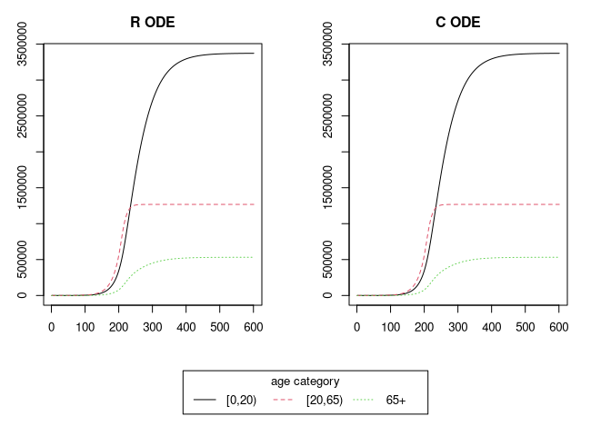

<!-- README.md is generated from README.Rmd. Please edit that file -->

# Exploration of deSolve with compiled code

<!-- badges: start -->
<!-- badges: end -->

## Example

Note, at present, the implementations assumes:

- a closed population (no births, deaths or ageing)
- no time dependent parameters or interventions.

``` r
library(seir)

# demography
contact_data <- suppressMessages(
    socialmixr::contact_matrix(
        socialmixr::polymod,
        countries = "United Kingdom",
        age.limits = c(0,20,65),
        symmetric = TRUE
    )
)

contact_matrix <- t(contact_data$matrix)
demography <- contact_data$demography$population
n <- nrow(contact_matrix)

# initial conditions
init <- matrix(
    c(S = 0.999999, E = 0, I = 0.000001, R = 0),
    nrow = n,
    ncol = 4L,
    byrow = TRUE
)

# epi parameters
alpha <- 1/3
beta <- 1.5/7
gamma <- 1/7

# time stuff
time_end <- 600
increment <- 1

# vaccination
vac_start <- c(0, 200, 0)
vac_end <- c(0, 300, 0)
nu <- c(0, 0.1, 0)

# R implementation
out_r <- seir_r(
    alpha, beta, gamma,
    contact_matrix, demography,
    init, time_end, 
    vac_start, vac_end, nu
)

# C implementation
out_c <- seir_c(
    alpha, beta, gamma,
    contact_matrix, demography,
    init, time_end,
    vac_start, vac_end, nu
)

# compare outputs
recovered_index <- (3*n + 2):(4*n + 1)
layout(matrix(c(1,2,3,3), ncol=2, byrow=TRUE), heights=c(4, 1))
op <- par(mai=rep(0.5, 4))
matplot(out_r[, recovered_index], ylab = "", xlab = "", type = "l", main = "R ODE")
matplot(out_c[, recovered_index], ylab = "", xlab = "", type = "l", main = "C ODE")
par(mai=c(0,0,0,0))
plot.new()
legend(
    title = "age category", x="center",
    legend=rownames(contact_matrix),
    ncol=n, col = seq_len(n), lty = seq_len(n)
)
```

<!-- -->

``` r
par(op)
microbenchmark::microbenchmark(
    R = seir_r(
        alpha, beta, gamma,
        contact_matrix, demography,
        init, time_end,
        vac_start, vac_end, nu
    ),
    C = seir_c(
        alpha, beta, gamma,
        contact_matrix, demography,
        init, time_end,
        vac_start, vac_end, nu
    )
)
#> Unit: microseconds
#>  expr       min        lq       mean    median         uq       max neval cld
#>     R 13435.144 13864.501 14521.9634 13977.051 14184.4135 21155.639   100  a 
#>     C   783.761   850.928   954.6386   907.135   999.0805  4002.192   100   b
```
